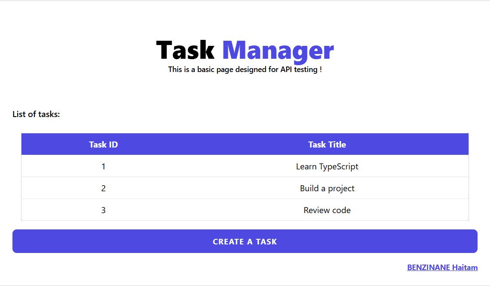
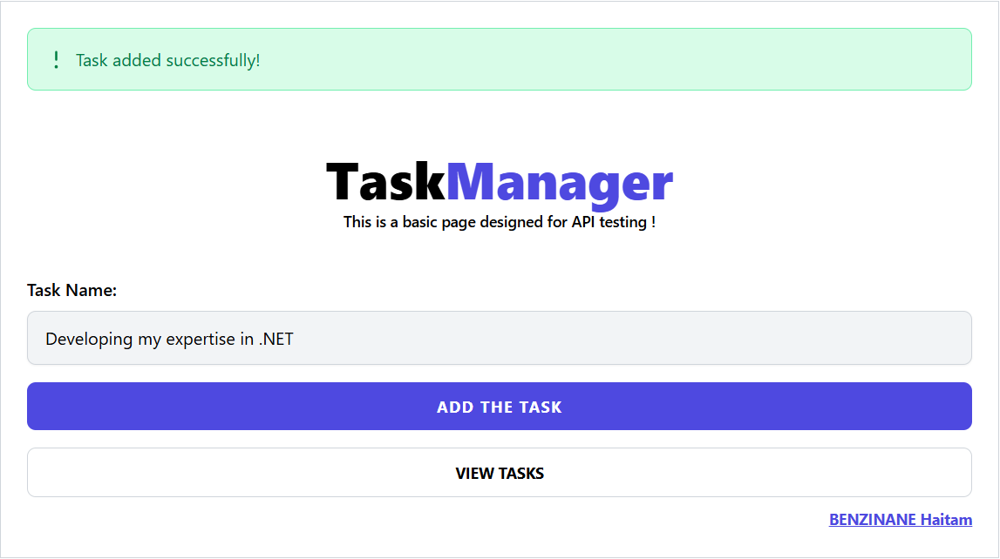

# Task Manager Test

 

 

This project is a simple task management application with a backend in Node.js (TypeScript) and a frontend in React.

## Objective

This exercise aims to develop a TypeScript API in Node.js without relying on frameworks, along with a React frontend component that interacts with the API.

### How to start this ?

A. Setup Backend

  1. Navigate to the `backend` folder.
  2. Run `npm install` to install dependencies.
  3. Compile the TypeScript code into JavaScript using : `tsc` (this step is already done).
  4. Run the server with the following command: `node ./dist/server.js`
  

B. Setup Backend
   1. Navigate to the `frontend/taskmanager` folder.
   2. Run `npm install` to install dependencies.
   3. Run `npm start` to start the frontend server on port 3001.

### Results
- `http://localhost:3001/taskManager`

